::: block

Scan this QR to follow the presentation on your mobile phone

::: 

---

## Trabajo Fin de Master

 Recurrent neural networks for ornithopter trajectory optimization

   
 

<small>Supervisor: José Miguel Díaz Báñez / Candidate: Luis David Pascual Callejo</small>

---

## Overview

1.  Ornithopter trajectory optimization problem
2.  Neural Networks preliminaries
3.  Propositions and basic results
4.  RNN implementation
5.  Results
6.  Conclusions  
7.  Future work

---

<!-- .slide: data-transition="slide" data-background="#4d7e65" data-background-transition="zoom" -->

## 1. Ornithopter trajectory optimization problem

<section>

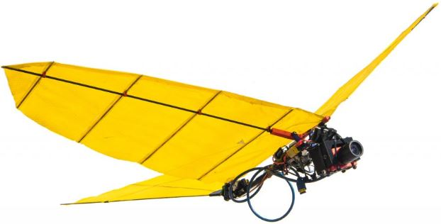

</section>

--

### 1. Ornithopter trajectory optimization problem

<section>

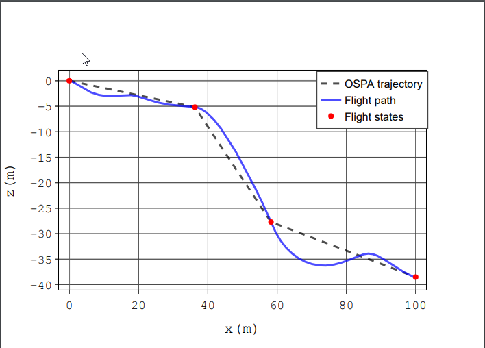

The problem we want to solve is to compute an optimal trajectory of an ornithopter connecting two given positions A and B while minimizing the energy consumption

</section>

---

### 1.1 The OSPA approach 

<section style="text-align: left;">

OSPA* (Ornithopter Segmentation Path Planning Approach) is a novel heuristic algorithm able to efficiently compute optimal trajectories.

Drawback: Time consuming. Cannot be embarked on the ornithopter for online computation. {.fragment .highlight-red}

<small>
OSPA* [2020]:

  * Title: Kinodynamic Planning for an Energy-Efficient Autonomous Ornithopter
  * Authors: F. Rodríguez and J. M. Díaz-Báñez and E. Sanchez-Laulhe and J. Capitán and A. Ollero

</small>

</section>

<section>

</section>

<section style="text-align: left;">

**Flight state:** describes an ornithopter configuration in a given instant of time. 
$$s = (x, z, u, w, \theta, q)$$

**Flight maneuver:** is a control action performed by the ornithopter.
$$a =(\delta, f)$$

</section>

---

### 1.1 optimal trajectory as a sequence of optimal actions

<section style="text-align: left;">

A trajectory can be defined as a sequence of flight maneuvers $A =(a_0, a_1, a_2, a_3...a_{n-1})$ that drives the ornithopter from the start point A to the vicinity of the target B.

Estimating the best action $a_i$ from a subset of them at each flight state $x_i$ constitutes a classification problem

</section>

--

### 1.1 optimal trajectory as a sequence of optimal states

<section style="text-align: left;">

A trajectory can be defined as a sequence of flight states $S = (s_0, s_1, s_2, s_3...s_n)$ from start point A to the vicinity of point B.

Predicting the sequence of flight states $x_i$ constitutes a regression problem

</section>

---

### 1.2 The RNN approach

<section>

> **Our proposal:** contour this problem using recurrent neuronal networks.

The neuronal network is tasked with learning the underlying optimal trajectory flight dynamics, which are in turn numerically estimated by the OSPA.

</section>

<section>

**Way of working:** OSPA is used to compute a set of optimal trajectories. The neuronal network is tasked to learning the underlying function from it. 

> **Goal**  obtain similar performances to OSPA with faster computation times.

</section>

---

### 1.3 OSPA data set

<section style="text-align: left;">

In order to feed the RNN, an OSPA optimal trajectories dataset is generated, composed by:

* Initial $s_{initial}$ and target $s_{target}$ states. 
* Sequence of flight states $S = (s_0, s_1, s_2, s_3...s_n)$.
* Sequence of flight maneuvers $A =(a_0, a_1, a_2, a_3...a_{n-1})$.
* Cost of the trajectory.
* Computation time.

</section>

<section style="text-align: left;">

In total, 236 different trajectories are generated:

| Variable   | Initial State     | Target State   |
|-------------|:-----------:|:----:|
| $X~(m)$ |  0 |  $[25,100]$ | 
|$Z~(m)$ |  0 | $[-40, 0]$ | 
| $\Theta~(^\circ)$ |  $[-30,30]$ | $30$  | 
| $U_b~(m/s)$ |  $[1,4]$ |  0  | 

</section>

---

<!-- .slide: data-transition="slide" data-background="#4e4d7e" data-background-transition="zoom" -->

## 2. Neural Networks preliminaries

---

### 2.1 Feedforward neural networks

--

### 2.1 Feedforward NN algebraic equations

<small>

\[\begin{aligned}
&a_i^k = b_i^k + \sum_{j = 1}^{r_{k-1}} w_{ji}^k o_j^{k-1} = \sum_{j = 0}^{r_{k-1}} w_{ji}^k o_j^{k-1}\\
&o_i^k = g(a_i^k)
\end{aligned} \]

</small>
---

### 2.2 NN's parametric family

<section style="text-align: left;">

> These equations form a parametric family $\{f^*(x;\theta )\mid \theta \in \Theta \}$.

where the family $f^*( x ;\theta)$ is given by the NN architecture and the parameters $\theta$ correspond to the NN weights $w_{ji}^k$.

</section>

<section>

> The goal can be reformulated as getting the best approximate $f^{\ast}(x;\hat{\theta})$ to the true underlying function $f$, which is in turn characterized by the OSPA optimal trajectory data set.

</section>

---

### 2.4 NN architecture

<section style="text-align: left;">

The family $\{f^\ast(x;\theta )\mid \theta \in \Theta \}$ is defined by the neuronal network architecture and activation functions, determined by:

* Depth and width of the network: number of parameters available.
* Activation functions and general architecture: set of functions that can be learned.

</section>

<section style="text-align: left;">

Due to the complexity of the ornithopter problem, our NN architecture must have the capacity to capture temporal dynamic behaviors.

> **Proposal:**  use a recurrent neural network with just one single layer to learn the OSPA underlaying trajectory flight dynamics 

</section>

---

### 2.4 NN parameter optimization

<section style="text-align: left;">

The optimal parameters $\theta^{*}$ for a given family are obtained by the optimization of a Loss function through the Gradient Descendent algorithm

$$\theta^{t+1}= \theta^{t} - \alpha \frac{\partial J(x, \theta^{t})}{\partial \theta}$$

</section>

---

### 2.5 Recurrent Neural networks

<section style="text-align: left;">

Connections between nodes form a directed graph along a temporal sequence. These connections allow previous outputs to be used as inputs.

</section>
--

### 2.5 LSTM Recurrent Neural networks

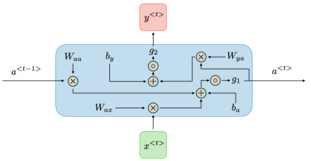

<small>
\[\begin{aligned}
&a_t =g_1( b_a + W_{aa}a_{t-1}+W_{ax}x_t) \\
&y_t = g_2(b_y + W_{ya}a_t)
\end{aligned} \]
</small>

---

<!-- .slide: data-transition="slide" data-background="#e3be29" data-background-transition="zoom" -->

## 3. Propositions and basic results

---

### 3.1 Universal approximator theorem

> Thanks to the Universal approximator theorem, $f^{\ast}(x;\hat{\theta})$ can approximate $f$ as much as desired.
 
The theorem is met since $f$ is a continuous function on a closed and bounded subset of $R^N$ is Borel measurable.

---

## 3.2 RNN unfolding

<section>

</section>

<section>

> **Theorem:** the unfolding property can only be applied if the following hypothesis is met: the conditional probability distribution over the variables at t+1 given the variables at time t, is stationary.

</section>

---

### 3.3 Maximum likelihood

<section>

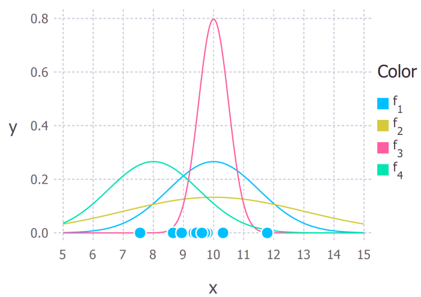

$$\theta_{ML} =  \arg\max_{\theta}  p_{model}(X;\theta) = \arg\max_{\theta}
\prod_{i=1}^m p_{model}(x_i ;\theta)$$

</section>

<section>

> **Proposal:** the ML method is proposed to estimate the parameter value $\hat{\theta}$ for a given family, so that under the assumed model $f^{\ast}(x;\hat{\theta})$, the observed data is the most probable. 

</section>

---

### 3.3 KL Divergence

<section>

> **Proposition:**  It is equivalent to use the Log-likelihood or the KL divergence as loss functions to compute the optimal parameters for our NN regression problem. 

$$\displaystyle D_{\text{KL}}(p_{data}\parallel p_{model})=-H_{p_{data}} - L(x;\theta)$$

</section>

<section style="text-align: left;">

The KL divergence loss function represents the amount of information lost when $p_{model}$ is used to approximate $p_{data}$.

</section>

---

### 3.3.1 problem types:  regression and classification

---

### 3.3 ML applied to the Regression problem

<section style="text-align: left;">

In the regression problem, the RNN aims to output the best possible approximation to the values of the true states in $R^6$ given by an OSPA trajectory.

$$y_i = \hat{y_i} + e_i$$

where  $\hat{y_i}$ is our prediction, $y_i$ is the real value and $e_i$ is the error due to non modeled aspects which is assumed to be Gaussian

</section>

--

### 3.3.1 Mean squared Error

> **Proposition:** given the above mentioned hypothesis, it is equivalent to use the Log Likelihood or the Mean Squared Error as loss functions for our NN.

<small>

</small>

---

### 3.4 Classification problem

<section style="text-align: left;">

The ornithopter possible action data set is actually a finite set of 35 different action tuples.

In the classification model each action $a_k$ is treated as a different category:
 $$a_k = (\delta_k, f_k), \ k =1,..., 35$$

</section>

<section style="text-align: left;">

In this case, the RNN will output the probability that each category has to be selected:

 $$\hat{y_k} = p(y_k|x,\theta)$$

where $\hat{y_k}$ is the vector with the predicted probabilities for each category $k$ and $y_k$ is the "one hot" representation of each category

</section>

---

### 3.4.1 Cross Entropy

<section>

> **Proposition:** It is equivalent to use the Log-likelihood or the Cross Entropy as loss function for our NN classification problem. 

<small>

</small>

</section>

<section style="text-align: left;">

The cross entropy loss function can be interpreted as the expected message-length per datum when a wrong distribution $p_{model}$ is assumed while the data actually follows a distribution $p_{data}$.

Or, when our neural network $f^{\ast}(x;\hat{\theta})$ is used instead of the real source of data, the OSPA planner.

</section>

---

<!-- .slide: data-transition="slide" data-background="#b5533c" data-background-transition="zoom" -->

## 4. RNN implementation

---

### 4.1 data pre-processing

1. From states to state distances: 
$$x_i = s_{target} - s_i$$
2. Data normalization:  
$$x_i = \frac{z_i }{\sigma}$$
3. Append target point to the OSPA trajectory
$$\vec{x}.append(x_{target})$$

---

### 4.2 output layer

---

### 4.2.1 classification output layer

The output layer consists on a dense layer with a softmax activation function

  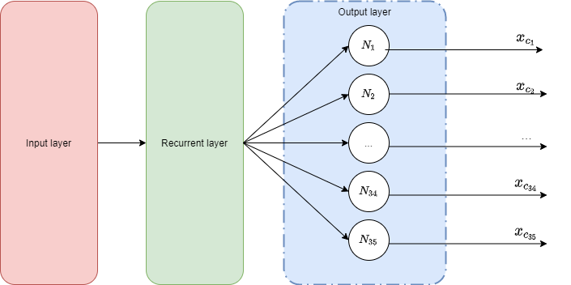

It transforms the output into the probability of predicting each specific class

--

### 4.2.1 classification output layer

> **Proposition:** If we assume that $p(x|y^k=1)$ follows a Gaussian, a softmax function is capable of estimating the probabilities of obtaining each of the categories using Bayes theorem

---

### 4.2.2 regression output layer

The output layer consists on a dense layer with a linear activation function

  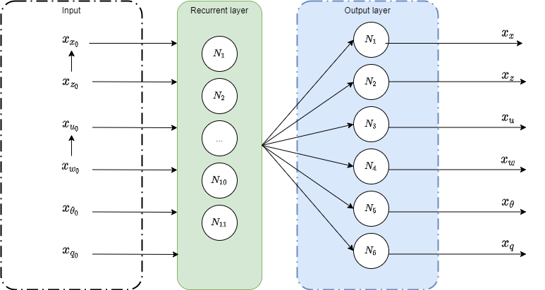

It transforms the output into the estimated value of each component

---

<!-- .slide: data-transition="slide" data-background="#3cb1b5" data-background-transition="zoom" -->

## 5. Results

---

### 5.1 action classification model

 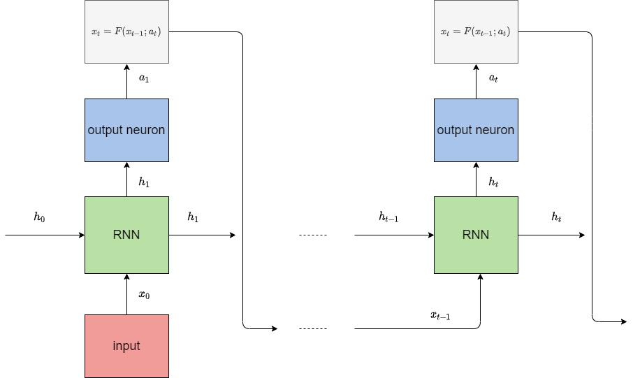

---

### 5.1.2 action classification training

<section style="text-align: left;">

 We use the KL divergence loss function as the measure of the dissimilarity between these two distributions
$$\displaystyle D_{\text{KL}}(p_{data}\parallel p_{model})=\sum_{x\in {\mathcal{X}}}p(a|x)\log \left({\frac {p(a|x)}{p(a|x;\theta)}}\right)$$
 to estimate $\hat{a} = p(a|x;\theta)$ as close as possible to the true action category value $p(a|x)$.

</section>

<section>

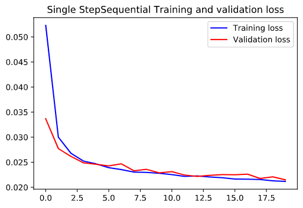

</section>

---

### 5.1.3 action classification results

<section>

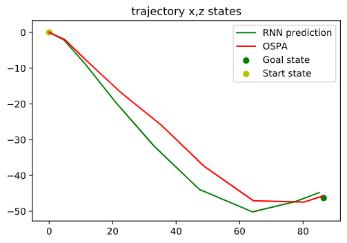

</section>

<section>

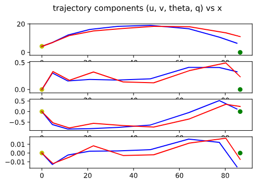

</section>

<section style="text-align: left;">

| Algorithm  | Cost (W)    | Time (s)    | Precision (m)   | Trajectory error (m)   |
|-------------|:-----------:|:----:|:----:|:----:|
| OSPA     | 34.68 | 520  |2.84 | N/A |
| Action prediction  |  37.25  |  0.43  | 6.29 |  3.85 |

</section>

---

### 5.1.3 Results - metrics

<section style="text-align: left;">

* **Cost:** $C=\sum_{i=0}^{n-1}c_i$,  the sum of the energy consumption of each of the actions.
* **Time (s):** is the total elapsed time in computing the full trajectory.
* **Precision (s):** is the distance in the XZ-plane from the final state to the target
* **Trajectory error (m):** is the mean of distance in the Z axis between the OSPA and the RNN trajectories at 10 given intermediary X-positions.

</section>

---

### 5.2.1 sequence to sequence model

 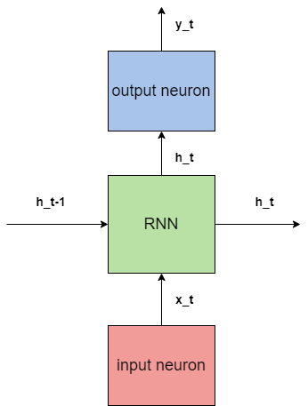
 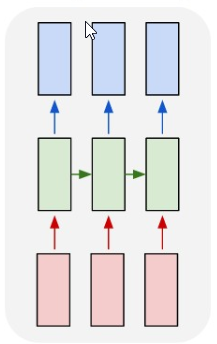

---

### 5.2.2 sequence to sequence training

<section style="text-align: left;">

 We use the MSE loss function as the measure of the dissimilarity between $p_{model}(x; \theta)$ and $p_{data}(x)$ 

$$\theta_{ML} =\theta_{mMSE}= \arg\max_{\theta}\sum_{i=1}^m {\frac {1}{2}}\left({y_i - \hat{y_i}  }\right)^{2}$$

 to estimate $\hat{y}$ as close as possible to the true state value $y$.

</section>

<section>

</section>

---

### 5.2.3 sequence to sequence results

<section>

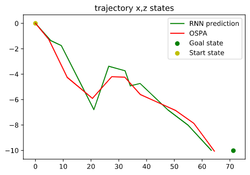

</section>

<section>

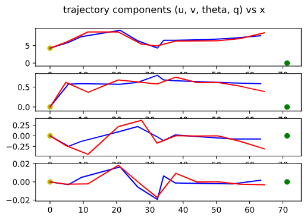

</section>

<section style="text-align: left;">

| Algorithm  | Cost (W)    | Time (s)    | Precision (m)   | Trajectory error (m)   |
|-------------|:-----------:|:----:|:----:|:----:|
| OSPA     | 34.68 | 520  |2.84 | N/A |
| Seq 2 seq  |  N/A  |  0.46  | 1.40 |  1.59 |

</section>

---

### 5.3 Decoder model

 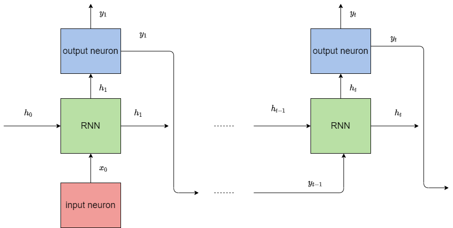

---

### 5.3.2 decoder training

<section style="text-align: left;">

 The network training is performed in exactly the same manner as for the sequence to sequence configuration. Actually, we are going to re-use the same optimal network parameters $\theta^*$.

</section>

---

### 5.3.3 decoder results

<section>

</section>

<section>

</section>

<section style="text-align: left;">

| Algorithm  | Cost (W)    | Time (s)    | Precision (m)   | Trajectory error (m)   |
|-------------|:-----------:|:----:|:----:|:----:|
| OSPA     | 34.68 | 520  |2.84 | N/A |
| Seq 2 seq |  N/A  |  0.46 | 1.40 |  1.59 |
| Decoder |  N/A  |  0.54  | 1.19 |  1.56 |

</section>

---

### 5.4.1 ODE integrator model

<section>

 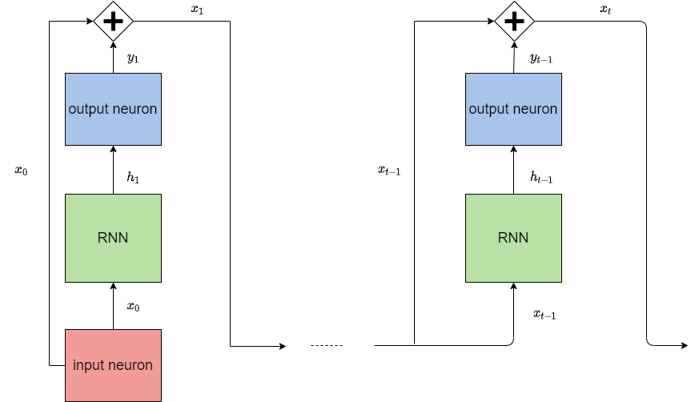

</section>

<section style="text-align: left;">

This configuration describes Euler's formula for the integration of the unknown function F over the time steps $\Delta t$

$$x_{t} = x_{t-1} + \Delta t*F(x_{t})$$

Which approximates:

$$x_{t} =f(x_0;t) =\int_{t_0}^t f^{'}(x;t)\,{dt} +x_0$$

</section>

---

### 5.4.2 ODE integrator model training

<section style="text-align: left;">

 Like the decoder, the training is performed using the same configuration as for the sequence to sequence configuration, using this time Ragged Tensors instead of padding during the implementation in Keras.

</section>

---

### 5.4.3 ODE integrator model results

<section>

</section>

<section>

</section>

<section style="text-align: left;">

| Algorithm  | Cost (W)    | Time (s)    | Precision (m)   | Trajectory error (m)   |
|-------------|:-----------:|:----:|:----:|:----:|
| OSPA     | 34.68 | 520  |2.84 | N/A |
| Decoder |  N/A  |  0.54  | 1.19 |  1.56 |
| ODE integrator |  N/A  |  0.76  | 1.32 |  1.55 |

</section>

---

## 6 Conclusions

<!-- .slide: data-transition="slide" data-background="#e38c22" data-background-transition="zoom" -->

---

### 6.1 Conclusions

<section style="text-align: left;">

On the theoretical side, expressions and choices derived or supported by:
1. The universal estimator theorem.
2. The NN algebraic equations.
3. The use of the maximum likelihood and information theory to determine optimal parameters.

</section>

<section style="text-align: left;">

On the application side:

| Algorithm  | Cost (W)    | Time (s)    | Precision (m)   | Trajectory error (m)   |
|-------------|:-----------:|:----:|:----:|:----:|
| OSPA     | 34.68 | 520  |2.84 | N/A |
| Action |  37.25  |  0.43| 6.29 |  3.85 |
| Decoder |  N/A  |  0.54  | 1.19 |  1.56 |
| ODE int.|  N/A  |  0.76  | 1.32 | 1.55 |

</section>

<section>

Code open and available in Github: https://github.com/paskymail/Neuronal_Networks

</section>

---

### 7 Future work
<section style="text-align: left;">

Further investigation lines:
1. Use of Deep NNs. 
2. Use of the information bottleneck theorem to explore Deep NNs.
3. Gathered and use additional training data.
4. Integration of additional features (i.e. obstacles). 
5. Include additional trajectory optimization metrics. 

</section>

---

### Thank you!

 