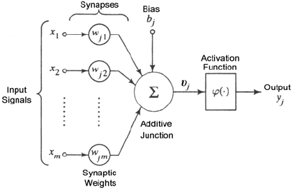
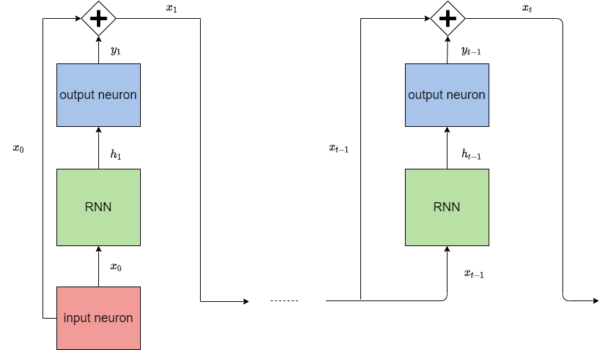

::: block
*Work in progress* {style=background:red;width:500px}
::: 

---

## Trabajo Fin de Master

 Recurrent neural networks for ornithopter trajectory optimization

 

<small>Supervisor: José Miguel Díaz Báñez / Candidate: Luis David Pascual Callejo</small>

---

## Overview

1.  Ornithopter trajectory optimization problem
    1.  OSPA approach
    2.  RNN approach
2.  Neural Networks preliminaries
    1.  Feedforward Neural Networks
    2.  NN's parametric family
    3.  Universal Approximator theorem
    4.  Neural Network architecture
    5.  Recurrent Neural Network

--

## Overview

3.  Propositions and basic results
    1.  Unfolding of RNN
    2.  Maximum likelihood method
    3.  ML for the regression problem
    4.  ML for the classification problem
4.  RNN implementation
    1.  Data pre-processing
    2.  Output layer
        1.  Classification
        2.  Regression

--

## Overview

5.  Results
    1. Action classification model
    2. Sequence to sequence model
    3. Decoder model
    4. ODE integrator model
6. Conclusions  

---

<!-- .slide: data-transition="slide" data-background="#4d7e65" data-background-transition="zoom" -->

## 1. Ornithopter trajectory optimization problem

---

### 1.1 Problem statement

> <small>The problem we want to solve is to compute an optimal trajectory of an ornithopter connecting two given positions A and B while minimizing the energy consumption</small>

---

### 1.1 Problem statement - states and actions

---

### 1.1 optimal trajectory as a sequence of optimal actions

---

### 1.1 optimal trajectory as a sequence of optimal states

---

### 1.2 The OSPA approach 

OSPA (Ornithopter Segmentation Path Planning Approach) is a novel heuristic algorithm able to efficiently compute optimal trajectories. 

Drawback: Time consuming. Cannot be embarked on the ornithopter for online computation.

---

### 1.3 The RNN approach

> **Our proposal:** contour this problem using recurrent neuronal networks.

The neuronal network is tasked with learning the underlying optimal trajectory flight dynamics, which are in turn numerically estimated by the OSPA.

--

### 1.3 The RNN approach

**Way of working:** OSPA is used to compute a set of optimal trajectories. The neuronal network is tasked to learning the underlying function from it. 

> **Goal**  obtain similar performances to OSPA with faster computation times.

---

<!-- .slide: data-transition="slide" data-background="#4e4d7e" data-background-transition="zoom" -->

## 2. Neural Networks preliminaries

---

### 2.1 Feedforward neural networks

--

### 2.1 Feedforward NN algebraic equations

<small>

\[\begin{aligned}
&a_i^k = b_i^k + \sum_{j = 1}^{r_{k-1}} w_{ji}^k o_j^{k-1} = \sum_{j = 0}^{r_{k-1}} w_{ji}^k o_j^{k-1}\\
&o_i^k = g(a_i^k)
\end{aligned} \]

</small>
---

### 2.2 NN's parametric family

> These equations form a parametric family $\{f^*(\cdot \,;\theta )\mid \theta \in \Theta \}$.

where the family $f^*(\cdot \,;\theta)$ is given by the NN architecture and the parameters $\theta$ correspond to the NN weights $w_{ji}^k$.

--

### 2.2 NN's parametric family

> The goal can be reformulated as getting the best approximate $f^{\ast}(x;\hat{\theta})$ to the true underlying function $f$, which is in turn characterized by the OSPA optimal trajectory data set.

---

### 2.3 Universal approximator theorem

> Thanks to the Universal approximator theorem, $f^{\ast}(x;\hat{\theta})$ can approximate $f$ as much as desired.
 
The theorem is met since a continuous function on a closed and bounded subset of $R^N$ is Borel measurable.

---

### 2.4 NN architecture

The neuronal network architecture and activation functions define the capacity the parametric family 
$$\{f^\ast(x;\theta )\mid \theta \in \Theta \}$$ 

The capacity is determined by:

* Depth and width of the network: number of parameters available.
* Activation functions and general architecture:  set of functions that can be learned.

--

### 2.4 NN architecture

Due to the complexity of the ornithopter problem, our NN architecture must have the capacity to capture temporal dynamic behaviors.

> **Proposal:**  use a recurrent neural network with just one single layer to learn the OSPA underlaying trajectory flight dynamics 

---

### 2.4 NN parameter optimization

Loss function

---

### 2.5 Recurrent Neural networks

A recurrent neural network (RNN) is a class of artificial neural networks where connections between nodes form a directed graph along a temporal sequence. These connections allow previous outputs to be used as inputs while having hidden states.
--

### 2.5 LSTM Recurrent Neural networks

<small>

\[\begin{aligned}
&a_t =g_1( b_a + W_{aa}a_{t-1}+W_{ax}x_t) \\
&y_t = g_2(b_y + W_{ya}a_t)
\end{aligned} \]

</small>
---

<!-- .slide: data-transition="slide" data-background="#e3be29" data-background-transition="zoom" -->

## 3. Propositions and basic results

---

## 3.1 RNN unfolding

---

## 3.1 RNN unfolding

> **Theorem:** the unfolding property can only be applied if the following hypothesis is met: the conditional probability distribution over the variables at t+1 given the variables at time t, is stationary.

--

### 3.2 Maximum likelihood

---

### 3.2 ML to estimate optimal parameters

> **Proposal:** the ML method is proposed to estimate the parameter value $\hat{\theta}$ for a given family, so that under the assumed model $f^{\ast}(x;\hat{\theta})$, the observed data is the most probable. 

---

### 3.2 problem types:  regression and classification

---

### 3.3.2 KL Divergence

> <small> **Proposition:**  It is equivalent to use the Log-likelihood or the KL divergence as loss functions to compute the optimal parameters for our NN regression problem. 

</small>

### 3.3 ML applied to the Regression problem

<small>
In the regression problem, the RNN aims to output the best possible approximation to the values of the true states in $R^6$ given by an OSPA trajectory.

$$y_i = \hat{y_i} + e_i$$

where  $\hat{y_i}$ is our prediction, $y_i$ is the real value and $e_i$ is the error due to non modeled aspects which is assumed to be Gaussian
</small>

--

### 3.3.1 Mean squared Error

> <small> **Proposition:** given the above mentioned hypothesis, it is equivalent to use the Log Likelihood or the Mean Squared Error as loss functions for our NN.

</small>

--

### 3.3.2 KL Divergence

<small>
The KL divergence loss function represents the amount of information lost when $p_{model}$ is used to approximate $p_{data}$.

Or in other words, when our neural network $f^{\ast}(x;\hat{\theta})$ is used instead of the real source of data, which is our OSPA planner.
</small>
---

### 3.4 Classification problem
<small>
The ornithopter possible action data set is actually a finite set of 35 different action tuples. This is due to the methodology of the OSPA to compute the optimal path, which requires a finite set of possible action outcomes in order to obtain a search tree.

In the classification model each action $a_k$ is treated as a different category, leading to 35 different categories: $$a_k = (\delta_k, f_k), \ k =1,..., 35$$

</small>
--

### 3.4 Classification problem

<small>
In this case, we want the RNN to output the probability that each category has to be selected:
 $$\hat{y_k} = p(y_k|x,\theta)$$
where $\hat{y_k}$ is the vector with the predicted probabilities for each category $k$ and $y_k$ is the "one hot" representation of each category
</small>

--

### 3.4.1 Cross Entropy

> <small> **Proposition:** It is equivalent to use the Log-likelihood or the CategoricalCross Entropy as loss function for our NN classification problem. 

</small>

--

### 3.4.1 Cross Entropy

<small>
The cross entropy loss function can be interpreted as the expected message-length per datum when a wrong distribution $p_{model}$ is assumed while the data actually follows a distribution $p_{data}$.

Or in other words, when our neural network $f^{\ast}(x;\hat{\theta})$ is used instead of the real source of data, which is our OSPA planner.
</small>

---

<!-- .slide: data-transition="slide" data-background="#b5533c" data-background-transition="zoom" -->

## 4. RNN implementation

---

### 4.1 data pre-processing

1. From states to state distances: 
$$x_i = s_{target} - s_i$$
2. Data normalization:  
$$x_i = \frac{z_i }{\sigma}$$
3. Append target point to the OSPA trajectory
$$\vec{x}.append(x_{target})$$

---

### 4.2 output layer

---

### 4.2.1 classification output layer

The output layer consists on a dense layer with a softmax activation function

  

It transforms the output into the probability of predicting each specific class

--

### 4.2.1 classification output layer

> **Proposition:** If we assume that $p(x|y^k=1)$ follows a Gaussian, a softmax function is capable of estimating the probabilities of obtaining each of the categories using Bayes theorem

---

### 4.2.2 regression output layer

The output layer consists on a dense layer with a linear activation function

  

It transforms the output into the estimated value of each component

---

<!-- .slide: data-transition="slide" data-background="#3cb1b5" data-background-transition="zoom" -->

## 5. Results

---

### 5.1 action classification model

 

--

### 5.1.1 action classification model

<section style="text-align: left;">
The configuration is as follows:

* Input layer: last predicted state $x_{t-1}$
* The recurrent layer: is expected to learn the function $h_{t} = f(h_{t-1}; x_{t-1})$
* Output layer: probabilities for the next action to apply a_{t}. 
* Fixed function: $x_t=F(x_{t-1};a_t)$

</section>

--

### 5.1.1 action classification model

Network summary

| Layer        | Output shape           |  parameter number   |
|-------------|:-----------:|:----:|
| LSTM      | [None, None, 11] | 792 |
| Dense      | [None, None, 35]       | 420   |
| Lambda      | [None, None, 6]       | 0   |

---

### 5.1.2 action classification training

 We use the KL divergence loss function as the measure of the dissimilarity between these two distributions
$$\displaystyle D_{\text{KL}}(p_{data}\parallel p_{model})=\sum_{x\in {\mathcal{X}}}p(a|x)\log \left({\frac {p(a|x)}{p(a|x;\theta)}}\right)$$
 to estimate $\hat{a} = p(a|x;\theta)$ as close as possible to the true action category value $p(a|x)$.

--

### 5.1.2 action classification training

---

### 5.1.3 action classification results

--

### 5.1.3 action classification - metrics

---

### 5.1.3 action classification results

Results summary

| Algorithm  | Cost (W)    | Time (s)    | Precision (m)   | Trajectory error (m)   |
|-------------|:-----------:|:----:|:----:|:----:|
| OSPA     | 34.68 | 520  |2.84 | N/A |
| Action prediction  |  37.25  |  0.43  | 6.29 |  3.85 |

---

## 6 Conclusions

<!-- .slide: data-transition="slide" data-background="#e38c22" data-background-transition="zoom" -->

--

### 6.1 Conclusions

<section style="text-align: left;">

On the theoretical side, all neural network expressions or choices have been mathematically derived or supported by three pillars:
1. The universal estimator theorem.
2. The development of the NN algebraic equations derived from the neuron ones.
3. The use of the maximum likelihood and its derivations to determine the optimal parameters for the paramedic family formed by the NN.

</section>

--

### 6.2 Conclusions

<section style="text-align: left;">

On the applications side, several RNN architectures have been applied to the specific problem of the ornithopter trajectory optimization:
1. The RNN has outperformed the OSPA method both in time (0.5s vs 520s) and precision to the target (1.19m vs 2.84m).
2. The RNN has been able to learn the underlying flight dynamics of the problem.
3. The ODE Integrator architecture has given a physically interpreted RNN behaviour.
4. All the results and choices have been justified using the mathematical background developed at the beginning of this thesis.

</section>

---

### 7 Future work

---

### Thank you!

 

---

### 5.3 Decoder model

 

---

### 5.4 ODE integrator model

 

---